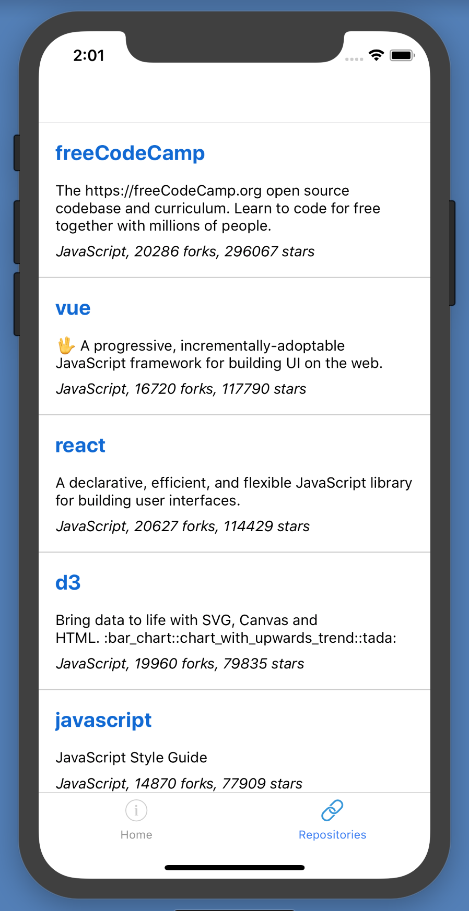

React Native Demo using Expo
============================



Quick Start
-----------
```bash
# Install Expo CLI
$ npm install -g expo-cli

# Install dependencies
$ yarn install

# Start Expo
# yarn start

```

This will start Expo DevTools in your browser. Now click on "Run on iOS simulator". The app will start running in the simulator.

Note: If the iOS simulator is not already open, you will get an error "Error opening simulator". In spite of this the simulator will open, but it will show the iOS Home screen. Just click on "Run on iOS simulator" again in DevTools to run the app.
